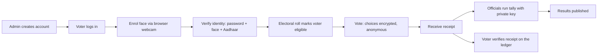
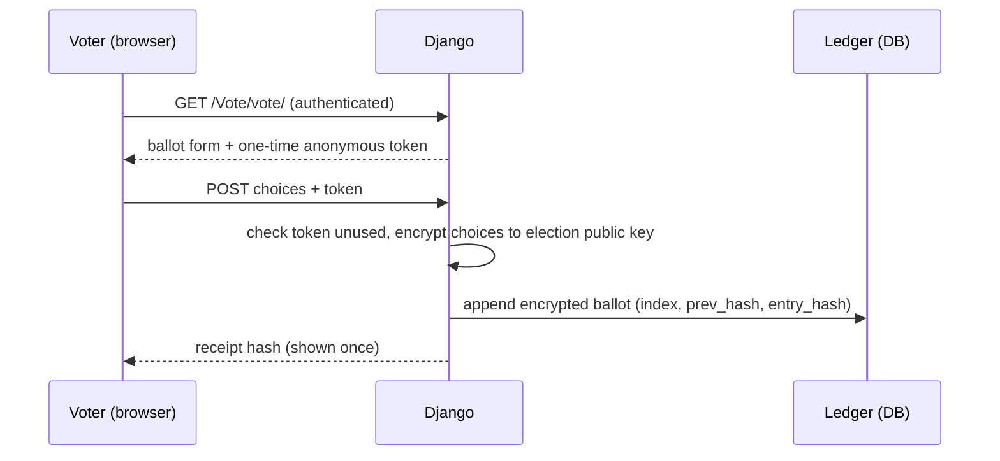

# Smart Voting System

An encrypted, secret-ballot e-voting **prototype** built with Django 5 and
OpenCV. Voters authenticate with a password, an optional face match, and an
optional (mock) Aadhaar check, then cast a ballot that is encrypted to the
election's public key and appended to a tamper-evident, blockchain-style ledger.

> **Prototype, not certified software.** This project demonstrates the mechanics
> of confidential e-voting. It is **not** approved for any real, binding
> election. Real Aadhaar authentication requires UIDAI AUA/KUA licensing, and
> production elections require key ceremonies, HSMs, independent audits and
> legal approval. See [SECURITY.md](SECURITY.md) and
> [docs/THREAT_MODEL.md](docs/THREAT_MODEL.md).

---

## Contents

- [How it works](#how-it-works)
- [Security properties](#security-properties)
- [Project layout](#project-layout)
- [Quick start](#quick-start)
- [Demo accounts](#demo-accounts)
- [Viewing the database](#viewing-the-database)
- [Manual testing](#manual-testing)
- [URL reference](#url-reference)
- [Configuration](#configuration)
- [Aadhaar integration](#aadhaar-integration)
- [Documentation](#documentation)
- [License](#license)

---

## How it works

**Stack:** Python 3.12, Django 5, OpenCV (LBPH face recognition), `cryptography`
(RSA-OAEP + AES-256-GCM, Fernet), SQLite by default.

### Voter lifecycle



### Casting a ballot (confidentiality + anonymity)



1. **Eligibility** is checked from the authenticated session and the electoral
   roll (`UserProfile`).
2. The choices are serialised and **encrypted** with the election's public key
   using hybrid encryption (a random AES-256-GCM key wraps the ballot; that key
   is wrapped with RSA-OAEP).
3. The ciphertext is appended to the **ledger**: each row stores the previous
   row's hash and its own hash, forming a blockchain-style chain. Any edit to
   history breaks the chain and is detectable.
4. The voter gets a **receipt** (a hash of the ciphertext) to prove inclusion.
5. The one-time **voting token** is consumed; only its SHA-256 fingerprint is
   stored, so it can never be replayed or traced back to a voter.

### Anonymity / no backtracking

`Ballot` has **no foreign key to a voter**. There is no stored row that maps a
person to the content of their vote. The only place a voter is recorded is the
electoral roll (`UserProfile.voted`), which records *that* they voted, never
*what* they voted. See the threat model for the residual assumptions.

### Tallying

The election private key never lives in the database. When officials run the
tally, every ciphertext is decrypted and counted; candidate totals are written
and results are published. Until then, results are hidden.

---

## Security properties

| Goal | Mechanism |
|------|-----------|
| Ballot confidentiality | RSA-OAEP + AES-256-GCM hybrid encryption to the election public key |
| Voter unlinkability | Ballot rows carry no voter reference; one-time token stored only as a hash |
| One person, one vote | Unique Aadhaar identity + single-use token + per-election identity record |
| Privacy of voter PII | Aadhaar and EPIC encrypted at rest (Fernet); only hashes kept for matching |
| Aadhaar-anchored identity | OTP + biometric (face/fingerprint/iris) matched 1:1 inside UIDAI; biometric never stored |
| Tamper evidence | Hash-chained, append-only ledger that can be re-verified |
| Individual verifiability | Receipt hash published on the ledger and verifiable by anyone |
| Least privilege | Tallies require staff access and the private key |

Known limitations (coercion resistance, key custody, side channels, etc.) are
documented honestly in [SECURITY.md](SECURITY.md) and
[docs/THREAT_MODEL.md](docs/THREAT_MODEL.md). Read them before trusting this
with anything real.

---

## Project layout

```
Smart-Voting-System/
├── HCI/                     Django project (settings, urls, wsgi)
├── Vote/                    Main app
│   ├── crypto.py            Ballot encryption, PII encryption, token hashing, ledger hashes
│   ├── face.py              Browser-frame face enrolment + LBPH matching
│   ├── aadhaar.py           Aadhaar verification interface + offline mock provider
│   ├── models.py            Election, Position, Candidate, UserProfile, Ballot, BallotToken
│   ├── views.py             Auth, enrolment, voting, tally, ledger, verification
│   ├── admin.py             Django admin registrations
│   ├── tests.py             Test suite
│   ├── management/commands/seed_demo.py   Reproducible demo data
│   └── templates/           HTML (browser-webcam enrolment/sign-in, ballot, ledger).
├── records/                 Voter detail pages reached after a face match
├── ml/                      Haar cascade + LBPH model and training dataset
├── docs/                    Architecture, threat model, Aadhaar, EPIC, deployment, manual testing
├── run.py                   One-command setup and launch
├── Dockerfile / Procfile    Deployment
├── requirements.txt
└── manage.py
```

---

## Quick start

Requires Python 3.11+ (developed on 3.12).

### One command (recommended)

```powershell
python run.py
```

`run.py` creates `.venv`, installs missing dependencies, applies migrations,
seeds demo data and starts the server. Options: `--host`, `--port`, `--no-seed`,
`--setup-only`.

### Manual

```powershell
# 1. Create and activate a virtual environment
python -m venv .venv
.\.venv\Scripts\Activate.ps1        # Windows PowerShell
# source .venv/bin/activate          # macOS / Linux

# 2. Install dependencies
pip install -r requirements.txt

# 3. Create the database and load demo data
python manage.py migrate
python manage.py seed_demo

# 4. Run the server
python manage.py runserver
```

Open <http://127.0.0.1:8000/>. The browser asks for camera permission on the
enrolment and face sign-in pages.

Run the tests with:

```powershell
python manage.py test
```

To let others test it for free (Docker, Render, Railway, tunnels), see
[docs/DEPLOYMENT.md](docs/DEPLOYMENT.md).

---

## Demo accounts

Created by `python manage.py seed_demo`.

| Username | Password | Role | Electoral roll id |
|----------|----------|------|-------------------|
| `thesrivas` | `thesri1234` | Admin (superuser) | `admin` |
| `guptaabhishek` | `gupta1234` | Voter | `1` |
| `guptaarchit` | `gupta1234` | Voter | `2` |
| `kanyalakshya` | `kanya1234` | Voter | `3` |
| `khatrimann` | `khatri1234` | Voter | `4` |
| `anurag` | `anu123456` | Voter | `201600713` |

These are demo credentials. The original committed `user_pass` file with
plaintext passwords has been removed; change every password before any real
use.

---

## Viewing the database

SQLite is a single file (`db.sqlite3`) with **no login** — there are no
credentials to enter. Four ways to inspect it:

**1. Django admin (recommended).** Open <http://127.0.0.1:8000/admin/> and log in
as the superuser `thesrivas` / `thesri1234`. Browse Election, Position,
Candidate, UserProfile, Ballot, BallotToken and VoterBallotRecord. Ballot
payloads appear as ciphertext, exactly as stored.

**2. Django shell.**
```powershell
.\.venv\Scripts\python.exe manage.py shell
```
```python
from Vote.models import Election, UserProfile, Ballot
Election.objects.all()
UserProfile.objects.values("id", "voted", "aadhaar_verified", "biometric_verified")
Ballot.objects.first().encrypted_payload   # ciphertext, not the vote
```

**3. DB Browser for SQLite (GUI).** Install it and open
`C:\Users\sriva\vedifie\personal\Smart-Voting-System\db.sqlite3`.

**4. `sqlite3` CLI** (if installed): `sqlite3 db.sqlite3`, then `.tables` and
e.g. `SELECT index, receipt_hash FROM Vote_ballot;`.

Configuration: the DB path can be overridden with the `DJANGO_DB_PATH`
environment variable (default `db.sqlite3`).

---

## Manual testing

A full, click-by-click checklist lives in
[docs/MANUAL_TESTING.md](docs/MANUAL_TESTING.md). The short version:

1. **Password login** – sign in as `guptaabhishek` / `gupta1234`; you are sent
   to the face step.
2. **Face sign-in** – open *Face Sign-in*, allow the camera, click *Verify*.
3. **Enrol a face** – *Add Facedata* → *Start capture* → *Save*.
4. **Verify identity (Aadhaar)** – *Verify identity* page; the mock provider
   shows a deterministic OTP for a valid 12-digit number.
5. **Vote** – pick one candidate per contest and submit; note the receipt.
6. **Verify the receipt** – on *Verify Vote*, paste the receipt.
7. **Public ledger** – *Public Ledger* shows the hash chain and its validity.
8. **Tally** – as `thesrivas`, run *Results → Run tally*; totals decrypt.
9. **Double voting** – refresh `/Vote/vote/` after voting; you are blocked.

---

## URL reference

| URL | Name | Purpose |
|-----|------|---------|
| `/` | – | Redirects to home |
| `/Vote/home/` | `home` | Landing page |
| `/Vote/login/` | `login` | Password login |
| `/Vote/logout/` | `logout` | Log out |
| `/Vote/face_login/` | `face_login` | Browser face sign-in |
| `/Vote/face_index/` | `face_index` | Face enrolment page |
| `/Vote/enroll/` | `enroll_face` | Enrolment frame upload (POST) |
| `/Vote/trainer/` | `trainer` | Retrain the classifier |
| `/Vote/aadhaar/` | `aadhaar_verify` | Mock Aadhaar verification |
| `/Vote/vote/` | `vote` | Cast an encrypted ballot |
| `/Vote/casted/` | `casted` | Ballot receipt |
| `/Vote/results/` | `results` | Results / run tally |
| `/Vote/tally/` | `tally` | Officials-only tally (POST) |
| `/Vote/bulletin/` | `bulletin` | Public hash-chained ledger |
| `/Vote/verify/` | `verify_ballot` | Verify a receipt |
| `/records/details/<id>/` | `details` | Voter record page |

---

## Configuration

Everything sensitive is read from the environment with development defaults in
`HCI/settings.py`:

| Variable | Default | Meaning |
|----------|---------|---------|
| `DJANGO_SECRET_KEY` | dev key | Django secret key |
| `DJANGO_DEBUG` | `True` | Debug mode |
| `DJANGO_ALLOWED_HOSTS` | `localhost,127.0.0.1,[::1]` | Allowed hosts |
| `DJANGO_CSRF_TRUSTED_ORIGINS` | empty | Trusted CSRF origins |
| `DJANGO_DB_PATH` | `db.sqlite3` | SQLite path |
| `DJANGO_TIME_ZONE` | `Asia/Kolkata` | Time zone |
| `ELECTION_KEY_DIR` | `keys/` | Election/PII key material (never commit) |
| `FACE_MATCH_THRESHOLD` | `55` | LBPH distance below which a match is accepted (lower = stricter) |
| `AADHAAR_PROVIDER` | `mock` | `mock` (offline) or `uidai` (not implemented) |

---

## Aadhaar integration

The app talks to an Aadhaar provider through `Vote/aadhaar.py`. The shipped
`mock` provider validates the real 12-digit Verhoeff checksum and issues a
deterministic demo OTP, entirely offline. Swapping in a real UIDAI integration
means implementing one interface and setting `AADHAAR_PROVIDER`.

Full design, data-flow and the licensing caveats are in
[docs/AADHAAR_INTEGRATION.md](docs/AADHAAR_INTEGRATION.md).

---

## Documentation

| Document | Contents |
|----------|----------|
| [docs/IMPLEMENTATION.md](docs/IMPLEMENTATION.md) | Implementation process and design decisions |
| [docs/ARCHITECTURE.md](docs/ARCHITECTURE.md) | Components, data model and request flows |
| [docs/THREAT_MODEL.md](docs/THREAT_MODEL.md) | What is protected, what is not |
| [docs/AADHAAR_INTEGRATION.md](docs/AADHAAR_INTEGRATION.md) | Aadhaar biometric design and production path |
| [docs/EPIC_MIGRATION.md](docs/EPIC_MIGRATION.md) | Encrypting and migrating the ECI electoral roll (EPIC) |
| [docs/DEPLOYMENT.md](docs/DEPLOYMENT.md) | Free hosting, Docker and platform notes |
| [docs/MANUAL_TESTING.md](docs/MANUAL_TESTING.md) | Manual test checklist |
| [SECURITY.md](SECURITY.md) | Security policy and reporting |
| [CODE_OF_CONDUCT.md](CODE_OF_CONDUCT.md) | Community guidelines |

**Long-form article (design + security deep-dive):** _add the Medium link here
once published._

---

## License

Released under the [MIT License](LICENSE).