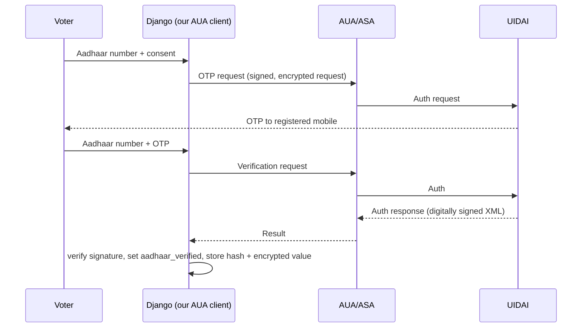

# Aadhaar Integration

This document explains how Aadhaar is used to bind identity to voting
eligibility, what the shipped **mock** provider does, and how to plug in a real
UIDAI integration.

## Why Aadhaar

Linking a verified Aadhaar identity to the electoral roll makes impersonation
("vote chori") hard: a ballot token is only issued after the voter proves
possession of their Aadhaar via OTP to the Aadhaar-registered mobile. The binding
is to **eligibility**, never to the ballot - the ballot itself carries no
identity.

## Interface

All access goes through `Vote/aadhaar.py`:

```python
result = aadhaar_service.get_provider().verify(number, otp=None, name="")
# result.success, result.verified, result.reference_id, result.message
```

Helpers:

- `is_valid_aadhaar(number)` - 12 digits, no leading 0/1, valid **Verhoeff**
  checksum.
- `mask_aadhaar(number)` - `XXXX-XXXX-1234` for display.

## The shipped mock provider (`AADHAAR_PROVIDER=mock`)

- Validates the real Aadhaar Verhoeff checksum offline.
- Issues a deterministic OTP derived from the number, so demos and tests are
  reproducible without any external service.
- Returns a `MOCK-...` reference id.

Flow in the app:

1. Voter submits their Aadhaar number (no OTP yet).
2. The page shows the deterministic mock OTP.
3. Voter resubmits with the OTP; the profile is marked `aadhaar_verified`.
4. Only `SHA256("aadhaar" || number)` and a Fernet-encrypted copy are stored -
   never the plaintext.

> A sample valid number for testing can be generated in a shell:
> `python -c "from Vote import aadhaar; b='23456789012'; print(next(b+str(c) for c in range(10) if aadhaar.is_valid_aadhaar(b+str(c))))"`.

## Real UIDAI integration

Real Aadhaar authentication is restricted. You need:

1. **Licensing** - become an AUA, or work through a licensed AUA/KUA/ASA.
2. **Onboarding** - UIDAI/KUA provides API specifications, credentials and
   certificates.
3. **Implement the provider** - add a class in `Vote/aadhaar.py` exposing the same
   `verify(...)` contract, and set `AADHAAR_PROVIDER=uidai`.

The typical real flow (simplified):



Key implementation notes for a real provider:

- **Verify the signed response** (UIDAI returns digitally signed XML) before
  trusting it; never trust the ASA blindly.
- **Require explicit consent** text and a timestamp before every auth request.
- **Data minimisation:** request the `demo auth`/`otp auth` you actually need,
  store only the reference id + hash, and purge encrypted copies on a schedule.
- **Handle failures** (retries, lockouts, technical failures) without leaking
  whether a number exists.
- **Never log** Aadhaar numbers or OTPs.

## Storage and privacy

| Value | Stored as | Purpose |
|-------|-----------|---------|
| Aadhaar number | Fernet-encrypted (`aadhaar_encrypted`) | Lawful audit only |
| Aadhaar number | `SHA256` (`identity_hash`) | De-duplication / matching |
| Verification status | boolean (`aadhaar_verified`) | Eligibility gate |
| Plaintext | never stored | - |

## Configuration

```
AADHAAR_PROVIDER=mock   # default, offline
AADHAAR_PROVIDER=uidai  # raises NotImplementedError until a provider is added
```

## Legal note

Aadhaar authentication is governed by UIDAI regulations and the Aadhaar Act.
Using Aadhaar in a voting system has additional legal and policy implications.
This repository is a prototype and makes **no** claim of regulatory compliance.
Obtain legal advice and the required licences before any real use.