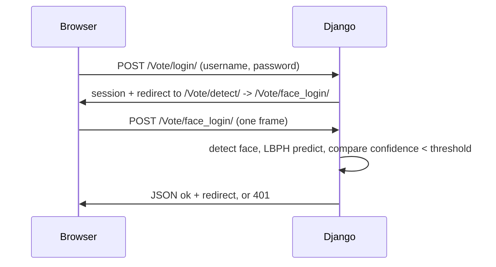
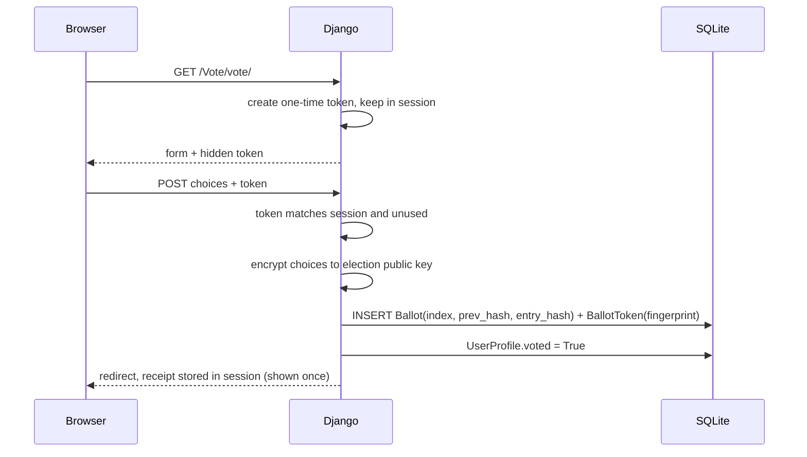
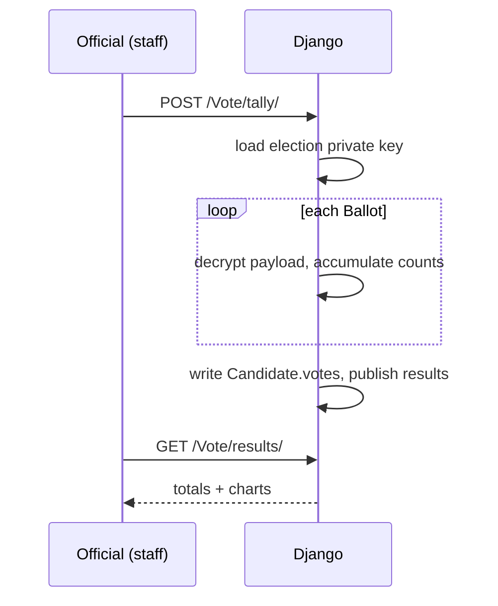

# Architecture

This document describes the components, data model and runtime flows of the
Smart Voting System prototype.

## Components

| Component | File | Responsibility |
|-----------|------|----------------|
| Cryptographic core | `Vote/crypto.py` | Ballot encryption, PII encryption, token fingerprints, ledger hashes |
| Face engine | `Vote/face.py` | Decode browser frames, detect/crop faces, enrol samples, train and match LBPH |
| Identity provider | `Vote/aadhaar.py` | Aadhaar validation and verification interface (+ offline mock) |
| Domain models | `Vote/models.py` | Election, Position, Candidate, UserProfile, Ballot, BallotToken |
| Controllers | `Vote/views.py` | Auth, enrolment, voting, tally, ledger, verification |
| Routing | `Vote/urls.py`, `HCI/urls.py` | URL map (app-level and project-level) |
| Templates | `Vote/templates/` | Browser pages, including webcam capture and the ballot |
| Records | `records/` | Voter detail page shown after a face match |

## Data model

```
Election 1─* Position 1─* Candidate
Election 1─* Ballot                       (no link to a voter)
UserProfile 1─1 User (Django auth)        (electoral roll)
BallotToken                               (fingerprints of spent tokens)
```

**Election** – `name`, `description`, `is_active`, `results_published`,
`public_key_pem`, `key_name`, `created_at`. Ballots are encrypted to
`public_key_pem`; the matching private key lives in `ELECTION_KEY_DIR`.

**Position** – a contest within an election: `position`, `no_of_candidates`,
`about`, FK `election`.

**Candidate** – `name`, `Description`, `image`, `votes`. `votes` is written only
by the tally.

**UserProfile** – the electoral roll: `id` (roll number, primary key), `user`
(one-to-one), `voted`, `identity_hash`, `aadhaar_encrypted`, `aadhaar_verified`,
`face_enrolled`, `created_at`.

**Ballot** – `election`, `encrypted_payload`, `receipt_hash` (unique), `index`,
`prev_hash`, `entry_hash`, `created_at`. Deliberately **no voter reference**.

**BallotToken** – `fingerprint` (SHA-256 of a token), `used_at`. No voter
reference.

## Cryptographic formats

**Encrypted ballot** (`crypto.encrypt_ballot`):

```
base64( u16(rsa_len) || RSA-OAEP(AES key) || AES-GCM nonce(12) || AES-GCM ciphertext )
```

- Payload JSON: `{ "<contest_id>": <candidate_id>, ... }`.
- AES key is 256-bit, fresh per ballot.
- Only the election private key can unwrap the AES key.

**Ledger entry** (`crypto.hash_hex`):

```
entry_hash = SHA256("ballot" || index || prev_hash || receipt_hash || encrypted_payload)
```

The first ballot chains from a genesis hash over the election identity.

**PII** – Aadhaar is stored Fernet-encrypted; `identity_hash = SHA256("aadhaar" || number)`
is kept for matching without decrypting.

**Voting token** – `secrets.token_urlsafe(32)`; stored as
`SHA256("voting-token" || token)`.

## Runtime flows

### Password + face authentication



### Ballot casting



### Tally



## Error handling and defaults

- Missing election → friendly message, redirect home.
- Missing private key at tally → explicit error; results stay hidden.
- No face detected → enrolment rejects the batch; sign-in returns 401.
- Token mismatch or reuse → ballot rejected, redirect back to the vote page.
- Legacy URLs (`/Vote/detect`, `/Vote/create_dataset`) redirect to the modern
  pages so old links keep working.

## Extension points

- **Aadhaar provider:** implement the interface in `Vote/aadhaar.py` and set
  `AADHAAR_PROVIDER`.
- **Threshold tally:** replace the single private key with trustee shares in
  `_tally`.
- **Blind-signature tokens:** replace session-issued tokens with blinded,
  signed tokens for true unlinkability.
- **Database:** point `DATABASES` at Postgres for concurrency.