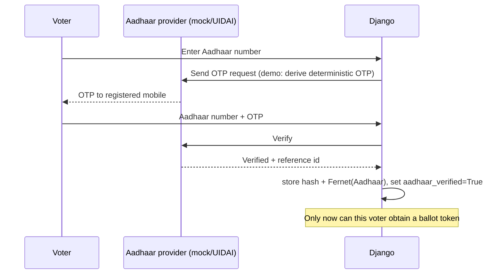

# Implementation Process

This document records how the project was turned from a college "face + password"
demo into an encrypted, nation-style secret-ballot prototype, and - most
importantly - how Aadhaar is intended to be bound to voting so that nobody can
cast someone else's vote ("vote chori").

## Goals

1. Make the project actually run on a current stack (Django 5, Python 3.12).
2. Replace the server-webcam face flow with a browser-webcam flow.
3. Make every ballot **encrypted**, **anonymous** and **verifiable**.
4. Bind identity (Aadhaar) to eligibility without linking it to the ballot.
5. Keep a **blockchain-style** tamper-evident ledger of ballots.
6. Remove leaked personal data (mobile numbers) and secrets.

## Step-by-step changes

### 1. Modernise the stack

- `django.conf.urls.url` (removed in Django 4) was replaced with `path`/`re_path`
  in `Vote/urls.py`, `records/urls.py` and `HCI/urls.py`.
- Hardcoded Linux paths (`/home/anurag/...`, `/home/mayank/...`) were replaced
  with `BASE_DIR`-relative settings: `FACE_CASCADE_PATH`, `FACE_DATASET_DIR`,
  `FACE_MODEL_PATH`, `STATIC_ROOT`, `MEDIA_ROOT`, `ELECTION_KEY_DIR`.
- `Image.ANTIALIAS` (removed in Pillow 10) was dropped in favour of OpenCV
  resizing so training and prediction share one pipeline.
- Migrations were squashed (the old ones were not importable) and a reproducible
  `seed_demo` command was added.
- Added `Vote/__init__.py`, `records/__init__.py`, `HCI/__init__.py` so the apps
  are proper packages and tests can be discovered.

### 2. Browser-webcam face auth

The original `detect()` opened `cv2.VideoCapture(0)` on the server in a blocking
window - impossible in a browser. Now:

- `face_index.html` captures N frames with `getUserMedia` and posts them to
  `/Vote/enroll/`.
- `face_login.html` captures one frame and posts it to `/Vote/face_login/`.
- `Vote/face.py` detects the face, crops to a fixed size and either stores
  samples or matches them with LBPH (`confidence < FACE_MATCH_THRESHOLD`).

### 3. Encrypted, anonymous ballots

`Vote/crypto.py`:

- Hybrid encryption: a fresh AES-256-GCM key encrypts the ballot; RSA-OAEP wraps
  that key with the election public key.
- The private key lives in `ELECTION_KEY_DIR` (excluded from version control),
  never in the database.
- `Ballot` has no foreign key to a voter.

### 4. One-time token + the Aadhaar binding that stops vote chori

"Vote chori" happens when someone votes as somebody else, votes twice, or when
an operator stuffs or alters ballots. The design counters each:

| Threat | Countermeasure |
|--------|----------------|
| Impersonation at the booth | Password **and** face match **and** verified Aadhaar required before a ballot token is issued |
| Same person voting twice | Electoral-roll flag `UserProfile.voted` + a single-use token whose fingerprint is consumed once |
| Ballot stuffing | Ballots are only accepted with a valid, unused token tied to an authenticated, eligible session |
| Altering a cast ballot | Ballots are encrypted and appended to a hash chain; edits break verification |
| Officials reading votes | Content is encrypted to a public key; the tally key is separate and can be threshold-held |
| Linking a voter to a choice | Ballot rows carry no voter reference; tokens are stored only as hashes |

**Intended Aadhaar flow (reference):**

The verified flag gates eligibility. The Aadhaar value itself is stored only as
a one-way hash (for de-duplication) plus a Fernet-encrypted copy (for lawful
audit) - never in plaintext, and never on a ballot.

**Stronger unlinkability (recommended for production):** issue the ballot token
with a **blind signature**. The voter blinds a random token, the authority signs
it without seeing it, the voter unblinds it and later submits it anonymously.
This removes the "server sees voter + token together" linkage that remains in
the prototype. The prototype instead keeps the token only in the session and
stores just its hash.

### 5. Blockchain-style ledger

Each ballot stores `index`, `prev_hash` and `entry_hash` where
`entry_hash = SHA256("ballot" || index || prev_hash || receipt || ciphertext)`.
`/Vote/bulletin/` shows the chain and re-verifies it; `/Vote/verify/` lets a
voter confirm their receipt is included. Because ballots already contain
election/positions, no separate block table is needed for a demo, though a
block-batching layer can be added on top of the same hash rule.

### 6. Tally and results

`/Vote/tally/` (staff only) loads the private key, decrypts every ballot, counts
choices and writes `Candidate.votes`, then publishes results. Until then, results
are hidden (`is_active`/`results_published`).

### 7. Privacy and secrets cleanup

- Removed every mobile number from all templates.
- Replaced the committed plaintext `user_pass` file with a documented, seeded
  demo dataset (`seed_demo`).
- Moved secret key / debug / hosts to environment variables with safe dev
  defaults.
- Added `.gitignore` for `keys/`, `.venv/`, `db.sqlite3`, `media/`,
  `staticfiles/`.

## Verification

- `python manage.py test` - the suite covers crypto round-trips, Aadhaar
  validation, biometric match/mismatch, the full cast → tally flow, one-vote-per-
  identity enforcement, double-vote blocking, receipt verification, EPIC import
  encryption and page rendering.
- The face pipeline was validated headlessly by training on the bundled dataset
  and matching synthetic scenes (correct matches at LBPH distance ≈ 20, well
  below the threshold of 55).

## What is intentionally left out

Real, certified national e-voting additionally needs UIDAI AUA/KUA licensing,
HSM-backed threshold key ceremonies, coercion resistance, independent audits and
legal approval. Those are described, not implemented - see
[THREAT_MODEL.md](THREAT_MODEL.md) and [AADHAAR_INTEGRATION.md](AADHAAR_INTEGRATION.md).